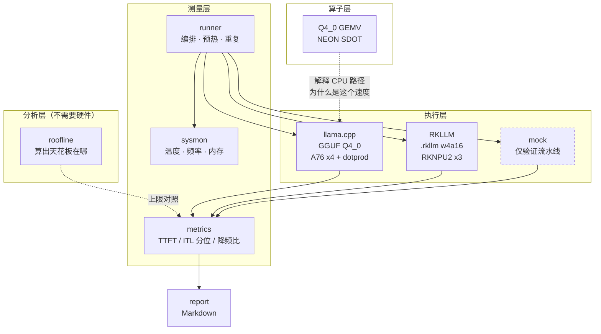

# RK3588 端侧 LLM 部署与优化

**CPU / NPU 双路径 benchmark + 算子优化**

在 RK3588 上跑大模型，第一个要回答的问题是「用 CPU 还是用 NPU」。
搜到的答案通常是「NPU 有 6 TOPS，当然用 NPU」——
这个答案在 prefill 阶段大致成立，在 decode 阶段基本是错的。

这个仓库用可复现的测量来回答这个问题，而不是靠标称参数推断。

---

## 核心论点

端侧 LLM 的两个阶段，瓶颈完全不同：

| 阶段 | 在做什么 | 算术强度 | 瓶颈 | 谁更快 |
| --- | --- | --- | --- | --- |
| **prefill** | 一次前向处理整个 prompt | 高（权重被复用 N 次） | **算力** | NPU 有明显优势 |
| **decode** | 逐 token 生成 | ~2 ops/byte | **内存带宽** | 两条路径差不多 |

关键在于：**RK3588 的 NPU 和 CPU 共享同一套 DRAM。**
decode 阶段每生成一个 token 都要把整份权重从内存里读一遍，
6 TOPS 的算力在这里派不上用场——瓶颈在搬数据，不在算数据。

用本仓库的 roofline 工具算一下（Qwen2.5-1.5B，Q4 量化，权重 826 MiB）：

```
$ python3 -m bench roofline --model qwen2.5-1.5b-q4 --prompt-tokens 512

  [cpu] RK3588 CPU (A76 x4 @2.4GHz, int8 dotprod)
    prefill (512 tok):    119.7 tok/s  受限于算力
    decode              :     19.4 tok/s  受限于带宽   (每 token 读 840 MiB)
  [npu] RK3588 NPU (RKNPU2, 3 core, int8)
    prefill (512 tok):    974.0 tok/s  受限于算力      <- 8 倍差距
    decode              :     19.4 tok/s  受限于带宽   <- 完全一样
```

**这是标称参数的推算，不是实测。** 项目的目标就是把这条推算换成实测数据，
并且量出实测离理论上限还差多远。

---

## 当前状态

> [!IMPORTANT]
> **还没有上板。仓库里没有任何真机 benchmark 数据。**
>
> 已完成的是测量框架、理论分析和算子实现；`results/` 目录是空的，
> 下面的结果表格全部待填。这个仓库刻意不放任何合成或估算的数字冒充实测结果——
> mock backend 产生的数据只能写进 `results/synthetic/`，并且报告会打上醒目标记，
> 这条约束有测试守着（`tests/test_runner.py`）。

| 模块 | 状态 |
| --- | --- |
| roofline 理论分析 | ✅ 可用 |
| 指标框架（TTFT / ITL 分位 / 降频检测） | ✅ 可用，36 个测试覆盖 |
| 温度 / 频率 / 内存采样 | ✅ 可用（非 RK 平台自动降级） |
| Q4_0 GEMV 内核（NEON dotprod） | ✅ 数值正确性已验证（qemu），**性能未测** |
| llama.cpp backend | ⚠️ 已实现，**未在真机验证** |
| RKLLM backend | ⚠️ 骨架，关键处标了 `VERIFY:` |
| HF → .rkllm 转换 | ❌ 待实现（需先核对 toolkit API） |
| 真机 benchmark 数据 | ❌ 需要板子 |

---

## 结果

### RK3588 真机

*（等板子到位后填入。在此之前这里保持空白，而不是放推算值。）*

| 模型 | 量化 | 路径 | prefill tok/s | decode tok/s | TTFT (ms) | 峰值内存 | 降频比 |
| --- | --- | --- | --- | --- | --- | --- | --- |
| — | — | — | — | — | — | — | — |

### x86 基线（真实测量，但不是目标硬件）

模型转换和量化在一台 Xeon 8558P 服务器上完成，顺手把 llama.cpp 在 x86 上的
数字也测了。**这些不是 RK3588 的预测值**——ISA 和内存带宽差了一个数量级——
它的用处是验证工具链和量化产物没问题，以及提供一个"格式之间相对关系"的对照。

完整数据、方法和分析见 **[`results/x86-baseline/`](results/x86-baseline/)**。

两个可以拿来对照的发现：

- x86 上 Q4_K_M 相对 Q8_0 的 decode 加速只有体积比的 **78%~95%**（9 组配置无一
  达到 100%），因为这台机器带宽太富裕，Q4_K_M 的解量化开销暴露了出来。
  RK3588 带宽只有它的约 1/20，**预期这个达成率会显著更高**——这是一条上板后
  可以直接证伪的预测。
- Qwen3-0.6B / 1.7B 的 GGUF 里 **embedding 存了两份**（有独立的 `output.weight`，
  尽管 `config.json` 写着 `tie_word_embeddings: true`），4B 才是真共享。
  0.6B 因此平白多占 100+ MB DRAM，在 4GB 板子上不是小数目。

---

## 快速开始

不需要板子也能跑的部分：

```bash
# 理论上限分析
python3 -m bench roofline

# 用合成 backend 验证整条流水线
python3 -m bench run --mock --out results
python3 -m bench report results/synthetic/bench-*.json

# 算子微基准（x86 上走标量路径，用于验正确性）
cd kernels && make run

# 交叉编译到 RK3588 并检查 SDOT 是否生成
make aarch64
aarch64-linux-gnu-objdump -d bench_gemv_rk3588 | grep -c sdot

# 测试
python3 -m pytest tests/ -q
```

板子到手之后：

```bash
bash scripts/collect_sysinfo.sh > results/sysinfo.txt   # 先摸清楚这块板子
bash scripts/build_llama_cpp.sh                          # 编 CPU 路径
```

---

## 架构



---

## 硬件

| 部件 | 规格 | 对 LLM 的意义 |
| --- | --- | --- |
| CPU | 4× Cortex-A76 @2.4GHz + 4× Cortex-A55 @1.8GHz | A76 是 **Armv8.2-A**：有 dotprod，**没有 i8mm/SVE** |
| NPU | RKNPU2，3 核，6 TOPS int8 | prefill 有优势；decode 受限于共享 DRAM |
| GPU | Mali-G610 MP4 | OpenCL 路径，本仓库暂未覆盖 |
| 内存 | LPDDR4/4x/5，标称 34.1 GB/s（LPDDR4x-4266） | **决定 decode 速度上限的就是它** |

Linux 下核编号：`cpu0-3` 是 A55 小核，`cpu4-7` 是 A76 大核。
跑 benchmark 要 `taskset -c 4-7` 绑大核——让线程漂到小核上会明显拖慢整体。

> A76 没有 i8mm 这一条很关键：网上大量 ARM 优化经验（尤其是针对 `SMMLA`
> 和 llama.cpp 的 `Q4_0_8_8` 重排路径）在 RK3588 上是走不到的。
> 详见 [`kernels/README.md`](kernels/README.md)。

---

## 测量方法

一个只报「平均 tok/s」的 benchmark 会掩盖端侧最要命的两件事，所以这里坚持：

1. **prefill 和 decode 分开报。** 用户感知的是 TTFT，它几乎全由 prefill 决定；
   把两段平均掉等于把问题藏起来。
2. **报 ITL 分位数而不只是均值。** 19 个 100ms 的间隔混进 1 个 1s 的卡顿，
   均值只有 145ms，但用户明显感觉到卡了——p99 才能抓到它。
3. **报降频比。** 前 25% token 的速率 ÷ 后 25% 的速率。RK3588 在被动散热的
   小盒子里跑几分钟就会降频，冷机数据和稳态数据能差 30%。
4. **原始时间戳全部落盘。** 指标可以事后重算，时间戳丢了就没了。
5. **合成数据物理隔离。** 见上面的「当前状态」。

---

## 目录

```
bench/          测量框架（roofline / metrics / sysmon / backends / runner / report）
kernels/        Q4_0 GEMV 内核 + 微基准，可独立编译
scripts/        环境采集、llama.cpp 编译、模型转换
configs/        模型清单、硬件参数、测量场景
docs/           硬件分析、双路径说明、测量方法学
tests/          pytest，不需要硬件
results/        测量结果（真机数据在根目录，合成数据在 synthetic/）
```

---

## 路线图

- [x] roofline 分析框架
- [x] 指标框架 + 降频检测
- [x] Q4_0 GEMV NEON dotprod 内核（正确性已验证）
- [x] mock 流水线 + 合成数据隔离
- [ ] **上板**：环境准备、驱动版本核对
- [ ] CPU 路径实测：线程数 / 绑核策略 / 量化方式扫描
- [ ] NPU 路径实测：补完 RKLLM 转换与 backend
- [ ] 双路径对比：速度 + 精度 + 内存 + 功耗
- [ ] GEMV 内核 vs llama.cpp 内建内核的对比
- [ ] 混合调度：prefill 走 NPU、decode 走 CPU 的可行性

---

## 许可

Apache-2.0，见 [LICENSE](LICENSE)。
